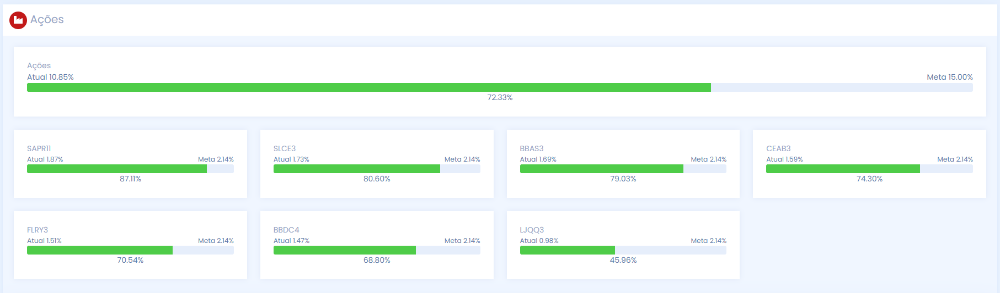
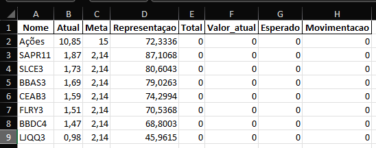

# Rebalanceador de Carteira de Investimentos

## Descrição

Este projeto é uma ferramenta automatizada para rebalancear carteiras de investimentos usando dados extraídos do site Carteira Holder. O script Python analisa a alocação atual dos ativos, compara com as metas estabelecidas e calcula as movimentações necessárias para atingir o equilíbrio desejado na carteira.

## Funcionalidades

- Extração de dados de alocação de ativos do site Carteira Holder via área de transferência
- Processamento de múltiplas categorias de investimentos
- Cálculo automático de movimentações para atingir as metas de alocação
- Geração de relatórios Excel para cada categoria de investimento
- Opção para limitar o valor total de movimentações

## Demonstração

### Fonte de Dados


### Resultado Final


## Pré-requisitos

- Python 3.x
- Bibliotecas Python: pandas, beautifulsoup4, pyperclip, openpyxl

## Instalação

### Clone o repositório:
```bash
git clone https://github.com/AndreLuis933/rebalanceador-carteira
```
### Crie e ative um ambiente virtual:
```bash
python -m venv venv
source venv/bin/activate  # Linux/MacOS
venv\Scripts\activate     # Windows
```
### Instale as dependências:
```bash
pip install -r requirements.txt
```

## Como Usar

1. Execute o script Python:
```bash
python main.py
```
2. Quando solicitado, insira o valor total da sua carteira.
3. Copie o conteúdo HTML da página do Carteira Holder para a área de transferência.
4. O script processará os dados e gerará arquivos Excel na pasta "Percentual" com os resultados do rebalanceamento.

## Estrutura do Projeto

- `main.py`: Script principal contendo toda a lógica de extração e processamento.
- `Percentual/`: Diretório onde os arquivos Excel de saída são salvos.

## Tecnologias Utilizadas

- Python
- pandas: Para manipulação e análise de dados
- BeautifulSoup: Para parsing de HTML
- pyperclip: Para acessar a área de transferência do sistema

## Licença

Este projeto está licenciado sob a Licença MIT - veja o arquivo [LICENSE](./LICENSE) para detalhes.
